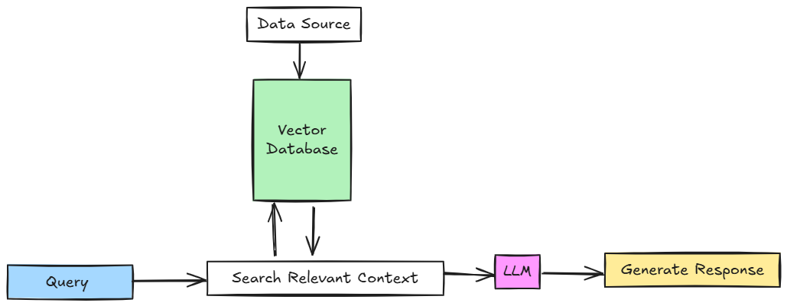

# chat-with-your-data
A powerful RAG (Retrieval-Augmented Generation) chatbot that enables interactive question-answering using PDF documents through advanced language processing technologies. <be>
 

# Technologies Used

1. **LangChain** Open-source framework for developing context-aware reasoning applications
2. **ChromaDB** High-performance vector database for efficient semantic search and document retrieval
3. **HuggingFace** Platform for accessing state-of-the-art pre-trained language models
4. **FastAPI** fast web framework for building APIs with Python based on standard Python type hints

# Project Overview
This project implements a sophisticated chatbot that allows users to interact with their PDF documents through intelligent semantic search and context-aware generation. By leveraging retrieval-augmented generation (RAG) techniques, the chatbot can understand and respond to queries based on the content of uploaded PDF files.

# Key Features
1. **Document Ingestion**: Seamless PDF document parsing and indexing
2. **Semantic Search**: Advanced vector-based document retrieval
3. **Context-Aware Responses**: Generate accurate answers using retrieved document contexts
4. **Scalable Architecture**: Modular design supporting multiple PDF documents

# Technical Approach
## Retrieval-Augmented Generation (RAG)
The chatbot uses a RAG approach that combines:

1. Document embedding using advanced language models
2. Vector storage in ChromaDB for efficient semantic search
3. Context retrieval based on user query similarity
4. Response generation using retrieved document contexts

## Model Selection
Utilizes pre-trained models from Hugging Face, selected for their:

1. High performance in natural language understanding
2. Ability to generate coherent and contextually relevant responses
3. Support for multilingual interactions
